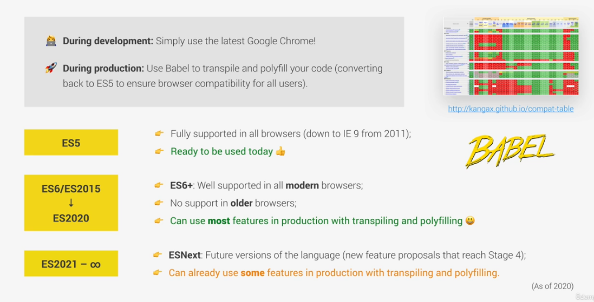
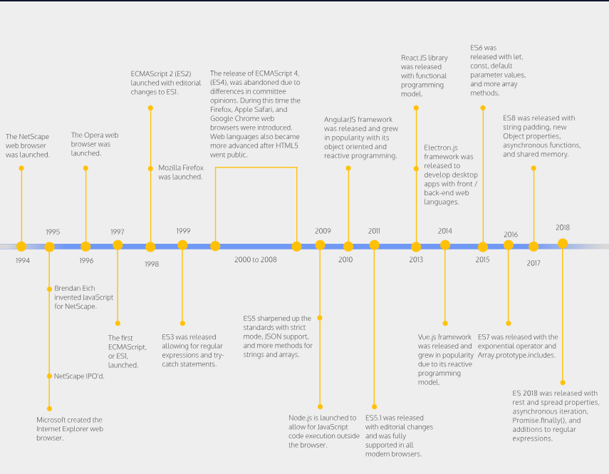

                        # JS review

        Js fundamentals part 1

1. what is js
   .high level language- dont have to think complex detail its easy to use and to understand
   .object oriented- based on objects storing most kind of data
   .multi paradigm- versatile we can use differnt styles of programming

2. node js- can run js with out using browser called runtime enviroment

3. js releases
   the old JS ----> ES5
   modern JS starts from JS ES6---> ES14

4. ES means ECMA Script
   ECMA is a standard for scripting language

5. values and variables
   value with out declaring a variable

   .varibale names cant start with numbers let 4month X
   .symbols arent allowed either except $ and \_
   .dont start varibales in capital letter not illegal but...
   .varaibales must make meaning dont just give random name easy to read

6. data type  
    two type of values

   1. object
   2. primitive value

   primitive value

   1. numbers- include decimal integer float its same for all
   2. string -for characters
   3. boolean- true or false

   4. undefined- not yet defined let childern;
   5. null- empty
   6. symbol(ES2015)- unique and cant be changed
   7. bigint(ES2020)-large integers than the number type can hold

   js has dynamic typing-- we dont have to manually define data type instead it is stored automatically

7. declaring variables

   let const and var

   var is the oldest in ES6

   let have similarities with var
   let can change values after assigning them
   and we can unidentify the value of the varibale

   const is the opp of let cant change values and can assign unknown value for variable.

8. math operators

   "\* \*\*" Exponent
   < > <= >= \* / - + %

9. operator precedence- important operator find on MDN

10. string and template literals
    we use template literals to connect strings
    ` ${vaiable}`

    \n new line
    \n\ multiple line
    ` ` multiline

11. if else statement
12. type conversion and type coercion

    type coercion is when the js automatically conversts the type( hidden from as)
    type conversion is when we change the type manually

13. truthy and falsy

falsy values 0, '', undefined,null,NaN

14. equality operator

=== strict equlity type coercison cant occur
== loose equality type coercion can happen int and str might be equal

15. prompt to input value
    we can add Number or String to specify the input value

16. boolean logic
    and, or, not
    && and || or ! not

17. switch statement
    switch and case statement
    this has same function as if else

18. statement and expressions

expression is code can express value
statement is cant express value
and template literal insert exprssion not statements

19. the conditional(ternary) operator
    same us if and switch but less lines
    we can use it in template literal

     Js fundamentals part 2

1. activating strict mode

   will treat errors more strictly

2. functions
   1.declaration
   2.expression
   3.arrow(Concise Body Arrow Functions) -----Functions that take only a single parameter do not need that parameter to be enclosed in parentheses. However, if a function takes zero or multiple parameters, parentheses are required.
   
   ------A function body composed of a single-line block does not need curly braces. Without the curly braces, whatever that line evaluates will be automatically returned. The contents of the block should immediately follow the arrow => and the return keyword can be removed. This is referred to as implicit return.
   

3. scope
   Scope defines where variables can be accessed or referenced. While some variables can be accessed from anywhere within a program, other variables may only be available in a specific context.
4. arrays
   push unshift ,,, pop shift

5. objects

assigning value for arrays of data similar to array

any funtion that is attached to a object is called Method

"this" keyword in javascript refers to an object when we are using it in method

6. Break and continue

The break statement "jumps out" of a loop.

The continue statement "jumps over" one iteration in the loop.

7.  loop
    backward i--
    forward i++

8.  while loop

    devloper skills

9.  prettier

10. vs snippet
11. debugging
12. using extensions
13. using console and breaking points
14. JS runtime such as node js
15. using stackoverflow and mdn

                what is DOM and what is DOM manipulation?

16.the DOM is used to represent a web page as a tree
of objects. Each node in the tree represents an element on the page, such as a heading, a paragraph, or an image. You can use the DOM to manipulate the page's content, style, and behavior.

adding event listeners
dom manipulations

DRY-----dont repeat your self principle

refactoring is to fix duplicated codes
